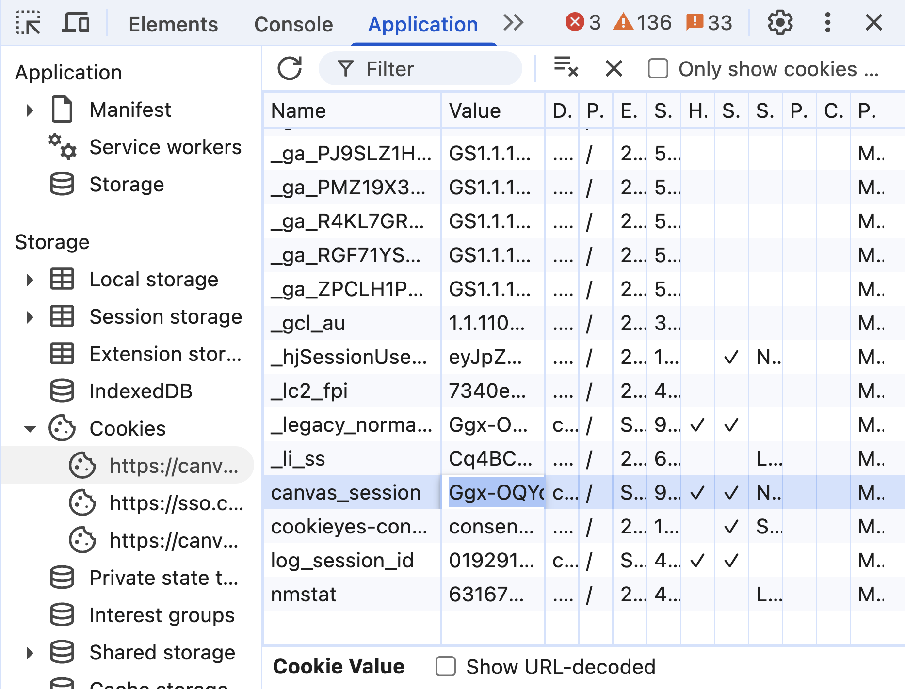

# Canvas Course Downloader

Canvas does not have a "download all files" button for a given course. Canvas expects you to manually download each file one-by-one, which is tedious and time-consuming.

This is a tool to scrape and download all accessible file content from a Canvas course, including assignments, pages, modules, files, and more. This tool systematically explores course content and downloads files for offline access or backup purposes.

**[ Discord Server for tech support](https://discord.gg/k7yNftGEAA)**

## How it works

The script uses the Canvas API to systematically explore course content. It:

1. Authenticates using your Canvas session cookie
2. Retrieves course information and content structure
3. Extracts file references from HTML content using regex patterns
4. Downloads all discovered files with proper organization
5. Saves a complete JSON manifest of all found files

The tool automatically discovers file references embedded in HTML content (assignments, pages, etc.) and downloads those files as well. Unlike simple file ID enumeration tools, this approach finds files that are actually linked to course content, making it more targeted and efficient. However, this approach will not find "hidden" files that are not linked anywhere in the course.

## Prerequisites

- Install Python 3 ([Installation Guide](https://realpython.com/installing-python/))
- Open a terminal (On macOS: `Command + Space` → type `Terminal`. On Windows: `Windows + R` → type `cmd`)
- Clone this repo and navigate to the directory:

```bash
git clone https://github.com/erict963/canvas-course-downloader.git
cd canvas-course-downloader
```

This script uses only Python's standard library - no additional packages required!

## Canvas Session Cookie (REQUIRED)

The `canvas_session` cookie allows the script to authenticate with Canvas on your behalf. **Never share this cookie with anyone you don't trust** - treat it like a password.

### Obtaining the Canvas Session

1. Log into your school's Canvas website
2. Navigate to any Canvas page
3. Right-click and select "Inspect" to open developer tools
4. Go to the "Application" tab
5. In the left sidebar, click "Cookies" → select your Canvas domain
6. Find the `canvas_session` cookie and copy its value



### Using Environment Variable

To avoid entering the session cookie each time:

```bash
export CANVAS_SESSION=your_canvas_session_value_here
```

On windows power shell, use:

```powershell
$env:CANVAS_SESSION="your_canvas_session_here"
```

On windows cmd, use:

```cmd
set CANVAS_SESSION=your_canvas_session_here
```

This allows the script to run without the `-s` argument (avoid passing the session value directly on the command line every time).

```bash
python3 main.py -u https://canvas.example.edu/courses/12345 -d
```

## Usage

### Basic Example

```bash
python3 main.py -u https://canvas.example.edu/courses/12345
```

### Download Files

To actually download the files (not just list them):

```bash
python3 main.py -u https://canvas.example.edu/courses/12345  -d
```

### Custom Output Directory

```bash
python3 main.py -u https://canvas.example.edu/courses/12345  -o my_courses -d
```

### Full Command Line Options

```
usage: main.py [-h] -u URL [-s CANVAS_SESSION] [-o OUTPUT_FOLDER] [-d]

Canvas course downloader

options:
  -h, --help            show this help message and exit
  -u, --url URL         The Course URL, e.g. https://canvas.example.edu/courses/123
  -s, --canvas-session CANVAS_SESSION
                        The Canvas session cookie (or set CANVAS_SESSION env var)
  -o, --output-folder OUTPUT_FOLDER
                        Output folder to save files (default: "output")
  -d, --download-files  Download the files found (default: only list them)
```

## Output Structure

The script creates an organized folder structure:

```
output/
└── CourseName_12345/
    ├── files/
    │   ├── lecture_notes.pdf
    │   ├── assignment_1.docx
    │   └── syllabus.pdf
    └── files.json
```

- `files/` - Contains all downloaded course files
- `files.json` - Complete manifest of all discovered files with metadata
